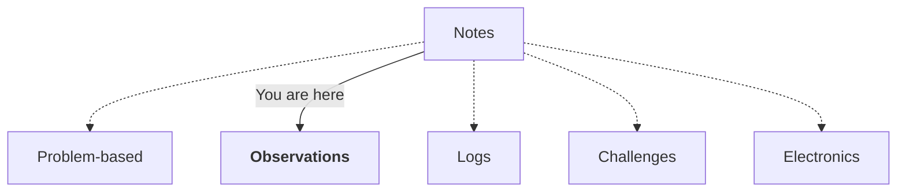

▲▼▲

This gist is a part of my [public notes](https://gist.github.com/wzulfikar/ba2f58d7aeeb3cf53743316f96f91594). Here's the "sitemap" of the notes:

<a href="https://gist.github.com/wzulfikar/ba2f58d7aeeb3cf53743316f96f91594">Problem-based</a> · <a href="https://gist.github.com/wzulfikar/2cff9bcd64ba5f15296e0b57ff402f79"><strong>Observations</strong></a> · <a href="https://gist.github.com/wzulfikar/5ea5779d7f2ea0e27809e94e7904f93d">Logs</a> · <a href="https://gist.github.com/wzulfikar/7d5e9426d1c7efc3ceeabb29adb2f4fd">Challenges</a> · <a href="https://gist.github.com/wzulfikar/16c3b5f10b8f28d8b0e325d03c948d1c">Electronics</a>
