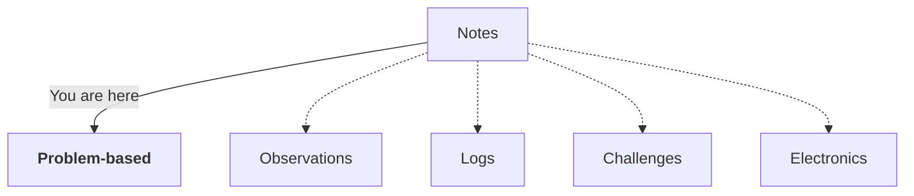

<h3 align=center>Hello world! 🌎</h3>

I write notes in this gist as comments. My original goal was to have a workflow where I can't have an excuse to not write. No websites to manage, no codes to push, no styles to update. Just write. I found Github gist fitting and I don't have issues with writing markdown.

This gist contains "problem-based", technical notes. I encounter a problem, I "google" the solution, I document the solution. Hopefully, I can accumulate the learning and don't have to google again when I encounter the same problem. 

Besides problem-based, I also write my "TIL" notes here. They are the new things I learnt that often gave me that "nice" feeling when I first found about it.

There are other things I write like electronics, observations, etc. which I put in different gists. If you want to check it, here's the "sitemap" of all my notes:

<a href="https://gist.github.com/wzulfikar/ba2f58d7aeeb3cf53743316f96f91594"><strong>Problem-based</strong></a> · <a href="https://gist.github.com/wzulfikar/2cff9bcd64ba5f15296e0b57ff402f79">Observations</a> · <a href="https://gist.github.com/wzulfikar/5ea5779d7f2ea0e27809e94e7904f93d">Logs</a> · <a href="https://gist.github.com/wzulfikar/7d5e9426d1c7efc3ceeabb29adb2f4fd">Challenges</a> · <a href="https://gist.github.com/wzulfikar/16c3b5f10b8f28d8b0e325d03c948d1c">Electronics</a>

▲▼▲
